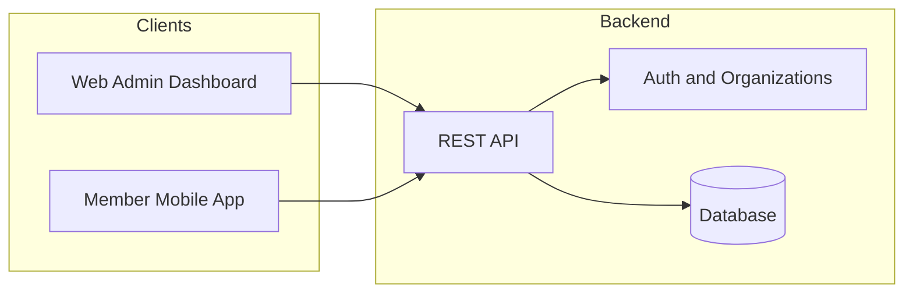

# Brnit — Project Status and Path to iOS/Android Release

This document summarizes what is built today, what remains to ship the member mobile app, and estimated time to publish on the App Store and Google Play. It is intended for sharing with the client.

---

## Overview

- **What is built:** Backend APIs, admin web dashboard, and a native app shell (auth + UI) are in place. The app and backend are already hosted.
- **What remains:** Connecting the mobile app to real data (diet plan, meals, consumptions, stats), completing member flows (log consumption, optional search and meal swaps), and preparing store submissions (assets, privacy policy, EAS builds).
- **Timeline:** Estimates assume **16 hours per week** of development; total effort is roughly **4–6 weeks** to a first store release.

---

## 1. What Has Been Built

### Architecture

Brnit is built as a single codebase (monorepo) containing:

- **Web app** — Next.js 16 (admin dashboard and auth pages).
- **Mobile app** — Expo 54 (React Native) for iOS and Android, with auth and main screens already implemented.
- **Shared packages** — Database schema and migrations, authentication and roles, environment config.

Authentication supports organizations, roles (admin, nutritionist, direct admin, coach, member), and invitations. Members can accept invites from the web or from the mobile app via a deep link.

### Backend (APIs)

All of the following are implemented and available on the hosted backend:

| Area | Features |
|------|----------|
| **Authentication** | Sign in, sign up, password reset, session handling, organization context (active org and role). |
| **Admin (app-level)** | Full management of food categories, food items, meals, and diet plans (create, read, update, delete, search, pagination). |
| **Nutritionist (per organization)** | Same as admin for categories, items, meals, and diet plans; plus diet plan assignments (assign plans to members) and view of meal consumptions. |
| **Direct admin (per organization)** | Members list and body composition assessments (InBody-style: height, weight, body fat %, BMI, muscle mass, visceral fat, body water, optional photo). |
| **Member (end-user)** | Current diet plan for a date range (assignment, daily meals, consumed status, any overrides); list and create diet plan consumptions; get alternatives for a food item; swap a meal item (get alternatives for a slot and save override). |

File and image uploads (e.g. for body composition) are supported via signed uploads to the media service.

### Database and Data Model

The database includes:

- **Auth and organizations** — Users, sessions, organizations, members, invitations (via the auth library).
- **Domain data** — Food categories, food items, meals, diet plans (with daily meal slots and items), diet plan assignments, meal consumptions, meal item overrides (swaps), and body composition assessments.

Migrations and schema are maintained in the shared database package.

### Web App (Admin Dashboard)

Fully implemented and in use:

- **Auth:** Login, signup, forgot password, reset password, accept invitation.
- **Dashboard:** Role-based home (admin, nutritionist, direct admin).
- **Admin:** Manage food items, meals, categories, and diet plans.
- **Nutritionist:** Same entities plus diet plan assignments (assign plans to members).
- **Direct admin:** View members and manage body composition assessments (add, edit, delete).
- **Organizations:** List organizations, view details, manage members and invitations (for owners and direct admins).

### Mobile App (Expo) — Current State

Already implemented:

- **Auth:** Login, sign-up, forgot password, reset password; accept invitation via deep link; secure session storage.
- **Navigation:** Four tabs — Home, Search, Stats, Profile.
- **Home:** Calendar strip, calorie ring, macro bars, and meal cards. **Currently uses sample data only** (no connection to the backend yet).
- **Search:** “Search Foods” and “Quick Add” UI only; no API integration.
- **Stats:** Placeholder layout with static numbers.
- **Profile:** Shows real user name and email, sign out works; Edit Profile, Notifications, Goals, and Help are placeholder entries.

Expo Application Services (EAS) is partially configured (project and over-the-air updates URL); production build profiles can be added or confirmed when preparing store builds.

---

## 2. What Remains for iOS/Android Release

### 2.1 Member Mobile App — Data and Features

| Area | Current state | Remaining work |
|------|----------------|----------------|
| **API integration** | Only authentication talks to the server. | Add a small API client that calls the backend with the user’s session (current diet plan, consumptions, assignments, alternatives, overrides). |
| **Home screen** | Displays mock meals, calories, and macros. | Load the user’s current diet plan and consumptions for the selected date. Replace mock data with real data. Add “Add Meal” (e.g. go to log consumption or add from plan). |
| **Search** | UI only. | Backend: a member-scoped “search food items” endpoint does not exist yet. Either add one (read-only, org food list) or reuse an existing endpoint with the right permissions. Then implement search and “quick add” to log consumption or pick an alternative. |
| **Log consumption** | Not implemented. | UI to mark plan meals as consumed and/or add a custom food to today’s consumption (if in scope). |
| **Meal item swap** | Not in the app. | Use existing APIs: show alternatives for a meal item, let the user pick one, and save the override. |
| **Stats** | Placeholder numbers. | Use consumption data (by date range) to show weekly totals and, if desired, a simple “streak” (e.g. consecutive days with at least one logged meal). |
| **Profile and settings** | Placeholders. | Edit profile (if the backend supports it), minimal settings, and a Help link or screen. |

### 2.2 Store Submission Readiness

| Item | Notes |
|------|--------|
| **App icon and splash** | Use production icon and splash (branded assets if the client provides them). |
| **Privacy policy** | Required for both stores; must be hosted at a public URL and linked in the app and in store listings. |
| **EAS Build** | Confirm or add build profiles for iOS and Android production and configure credentials. |
| **Apple App Store** | App record in App Store Connect, screenshots, description, keywords, age rating, etc. TestFlight for testing before submission. |
| **Google Play** | Listing in Play Console, content rating, data safety form, then internal/test track and production. |
| **Invite links** | Accept-invitation already works with a custom app link. Optionally add iOS Universal Links and Android App Links for production invite emails. |

### 2.3 Optional or Later

- Full edit-profile API and UI.
- Push notifications (requires backend and device setup).
- Offline support or improved caching.
- Member food search (if not included in the first release).

---

## 3. Time Estimates (16 Hours/Week)

Estimates assume one developer at **16 hours per week**. They include buffer for review, QA, and store feedback. Calendar is approximate.

| Phase | Scope | Estimated hours | Approx. calendar |
|-------|--------|------------------|-------------------|
| **1. API client + Home** | HTTP client with auth, load current diet plan and consumptions for selected date, replace mock data, “Add Meal” entry point | 12–18 | ~1–1.5 weeks |
| **2. Search + food** | Member food search (endpoint if needed + mobile), quick add to log consumption | 10–16 | ~1 week |
| **3. Log consumption** | UI to mark plan meals as consumed and/or add custom food (if in scope) | 8–12 | ~0.5–1 week |
| **4. Meal item swap** | Show alternatives for a meal item, select and save override | 6–10 | ~0.5 week |
| **5. Stats** | Weekly summary and optional streak from consumption data | 4–8 | ~0.5 week |
| **6. Profile/settings** | Edit profile (if API exists), minimal settings, Help link/screen | 4–6 | ~0.25 week |
| **7. Store assets and policy** | Final icon/splash, privacy policy page and URL | 2–4 | ~0.25 week |
| **8. EAS + store submission** | Build config, credentials, first production build; App Store Connect and Play Console setup; first submission and any fixes | 12–20 | ~1–1.5 weeks |

**Total:** about **58–94 hours** → roughly **4–6 weeks** at 16 hours/week. The upper end allows for a new member food-search endpoint, full “add custom food” flow, and store review cycles.

**Suggested MVP for first release:** Home with real plan and consumptions, log consumption (from plan), Stats from real data, Profile (sign out and minimal settings), privacy policy, then store submission. Search and meal-item swap can follow in a quick update after launch if agreed with the client.

---

## 4. Assumptions and Open Points

- **Member food search:** If the first release should let members search the organization’s food list and add items to their consumption, a member-scoped food search/list endpoint is required; add about **6–10 hours** to the estimate.
- **First release scope:** The estimates assume that a minimal v1 (“view my plan + log consumptions + see stats”) is acceptable; if Search and meal-item swap must be in the first submission, the timeline extends accordingly.
- **Store accounts:** The “EAS + store submission” estimate includes time for Apple Developer and Google Play Console setup and first-time EAS credential configuration, if not already done.

---

*Document generated for client review. For technical details (API routes, schema), refer to the codebase and internal docs.*
