# Stack overhaul — handoff

brnit has been rebuilt on the stack qpadel uses. This document is what one
engineer would tell another before walking away from it: what changed, what
was proven, what was found broken along the way, what still needs a human's
decision, and what could not be checked in this environment.

Branch: `claude/brnit-stack-overhaul-e89vwy` · PR [#17](https://github.com/nadersafa1/brnit-app/pull/17)

---

## 1. What this was, and what it is now

| | Before | After |
| --- | --- | --- |
| Package manager | npm 10.8.2, Node ≥ 20.19 | Bun 1.3.12, workspaces + a shared catalog, `linker = "hoisted"` |
| Apps | 2 — `web` (Next.js 16), `native` | 3 — `server`, `web`, `native` |
| API | 41 Next.js `route.ts` handlers inside the web app | `apps/server`, a standalone Express API, 57 routes |
| Web | Next.js App Router (SSR + route handlers) | Vite 6 + TanStack Router, a pure SPA |
| Native | Expo | Expo + Expo Router, pointed at the new API |
| Shared packages | 4 — `auth`, `config`, `db`, `env` | 13 — see below |
| Scope | `@burn-app/*` | `@brnit/*` |
| Database | PostgreSQL + Drizzle | unchanged, deliberately — see §3 |
| Jobs | none | BullMQ + Redis, in a separate worker process |
| Realtime | none | Socket.IO with a Redis adapter |
| Push | none | Firebase Cloud Messaging + Expo device tokens |
| Observability | none | pino with request context, OpenTelemetry (opt-in) |
| Lint / format | none in the root manifest | Biome + Ultracite (tabs, double quotes), Knip |
| Tests | vitest, in the web app only | `bun:test`, co-located, 926 across the workspace |

The diff against `main` is 1,059 files: +78,293 / −510,933. The large deletion
is mostly `package-lock.json` and the food-data seed fixture; the meaningful
part is that the Next.js app and its 41 route handlers are gone.

## 2. Layout

```
apps/
  server/     Express API, BullMQ workers, Socket.IO         57 routes, 11 controllers
  web/        Vite + TanStack Router SPA                     35 route files
  native/     Expo app                                       19 screens
packages/
  api/        zod schemas, DTOs and business handlers — the contract
  audit/      request-level audit-log writer
  auth/       Better Auth configuration, emails, permissions
  brand/      design tokens (TS + CSS)
  config/     shared tsconfig base
  datetime/   UTC calendar-date helpers
  db/         Drizzle schema, client, migrations
  domain/     framework-free domain rules
  env/        validated environment, split server / web / native
  logger/     pino + OpenTelemetry
  push/       Firebase send + shared schemas
  realtime/   socket event contracts
  ui/         shared React components
```

### The one rule that holds the whole thing together

`@brnit/api` is the single source of truth for the HTTP contract. Input
schemas, output DTOs and business handlers all live there, so the server and
both clients are checked against one definition.

- `apps/server` controllers are thin Express adapters: parse, build context,
  call the handler, respond. There is no business logic in a controller.
- `apps/web` and `apps/native` import **types, schemas and pure helpers only** —
  never `@brnit/api/handlers/*` or `@brnit/api/db/*`, which would pull Drizzle
  into a browser bundle.

Handlers stay free of infrastructure. A handler that needs to send an email, a
push, a realtime event or a job returns an *intent* alongside its DTO, and the
controller dispatches it after the handler returns, through a function that
cannot reject the request. That inversion is why `@brnit/api` has no dependency
on BullMQ, socket.io or firebase-admin, and why the same handlers are safe to
import from a client bundle for their types.

## 3. Decisions worth knowing

| Decision | Why |
| --- | --- |
| **Drizzle stays.** Not ported to Prisma. | 24 existing migrations, 21 tables, 4 CHECK constraints and a live database. A rewrite buys nothing the contract layer doesn't already give, and risks a lot. You asked for this explicitly. |
| **Offset pagination stays.** Not switched to qpadel's cursor. | Every list screen has numbered pages and a total count. Cursor pagination cannot express "page 7 of 12". |
| **Full API split**, not a shim. | The web app is now static assets — deployable to any CDN — and native talks to exactly the same server as web. |
| **Vite + TanStack Router**, not Next.js. | Matches qpadel. With the API extracted, nothing in the web app needed a server. |
| **`db:seed` is out of `db:deploy`.** | The seed truncates the food catalogue and cascades into meals, diet plans, consumption and override rows. It was reachable from a deploy command. It now refuses to run without an explicit fixture path. |

## 4. Screenshots

> **These are rendered against a fixture API, not a live database.** PostgreSQL
> is not installed in this environment and the Docker daemon is unavailable, so
> the real server cannot boot here. A small Bun stub served fixture responses on
> the same routes the SPA calls, and the production bundle (`vite build`) was
> pointed at it.
>
> What this proves: the screens render, the routes resolve, the guards let an
> authenticated admin through, the search params parse, and the design system is
> applied. What it does **not** prove: any server behaviour, any query, any
> business rule. Those are covered by the test suite (§5), not by these images.

Captured at 2× device scale, zero page errors on every shot.

### Auth

| | |
| --- | --- |
| 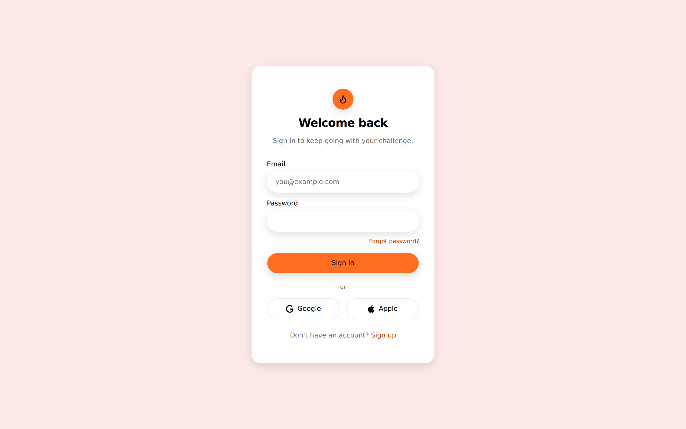 | 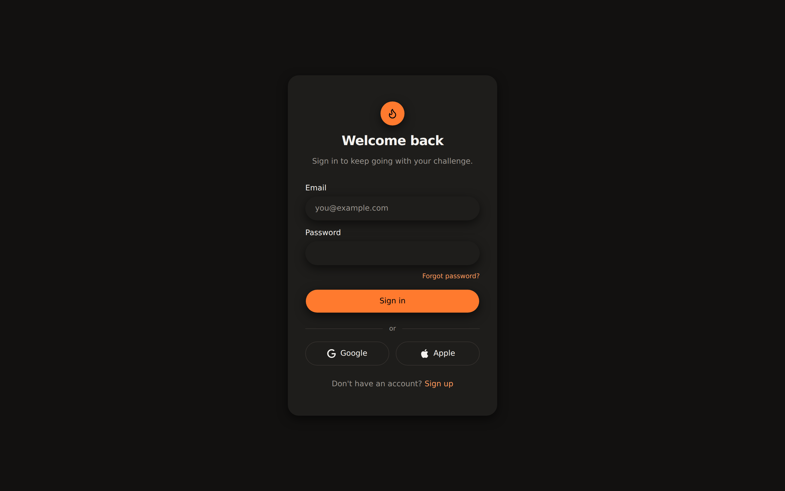 |
| `/login` — light | `/login` — dark |

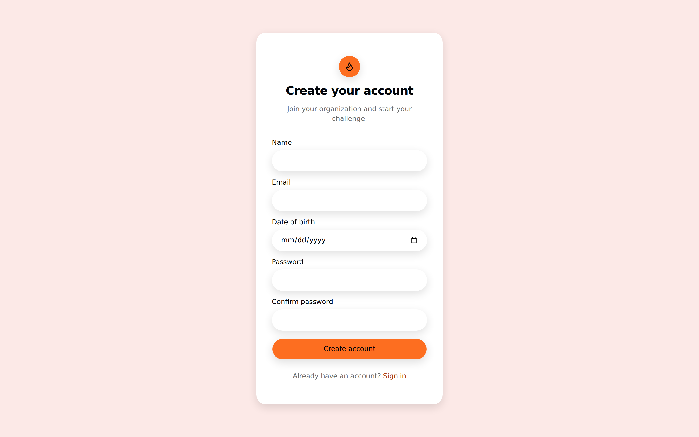

`/signup`. Both themes come from the same token set in `@brnit/brand`; nothing
is hard-coded per theme.

### Dashboard

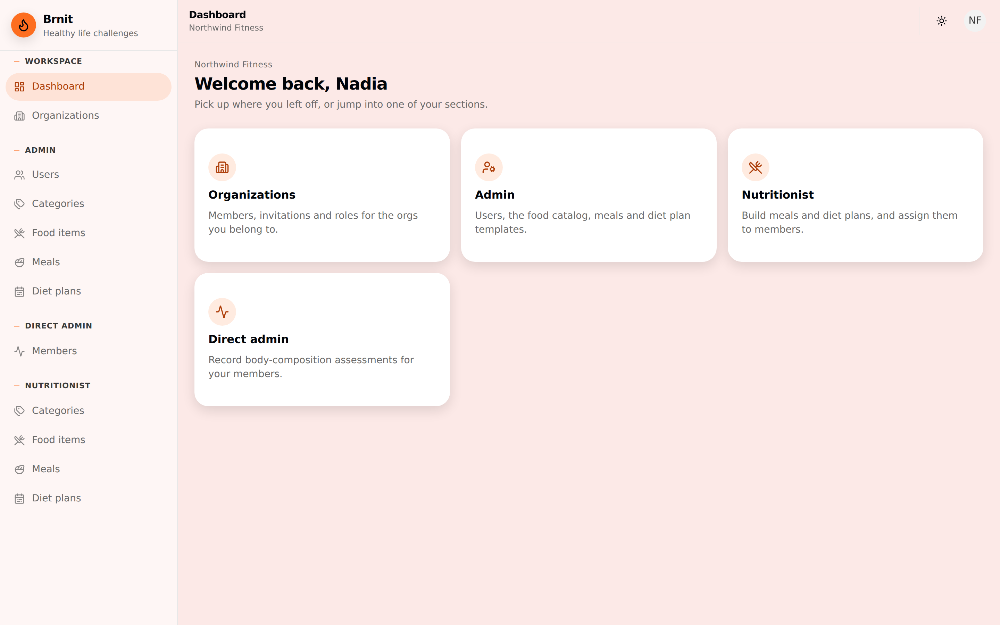

`/dashboard`. The sidebar is grouped by role — Workspace, Admin, Direct admin,
Nutritionist — and each group only renders for a user who holds it. The cards
mirror the same grouping.

### Admin

| | |
| --- | --- |
| 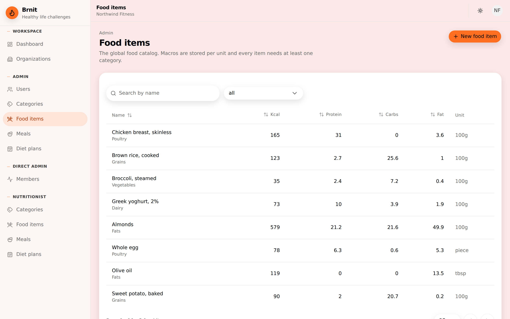 | 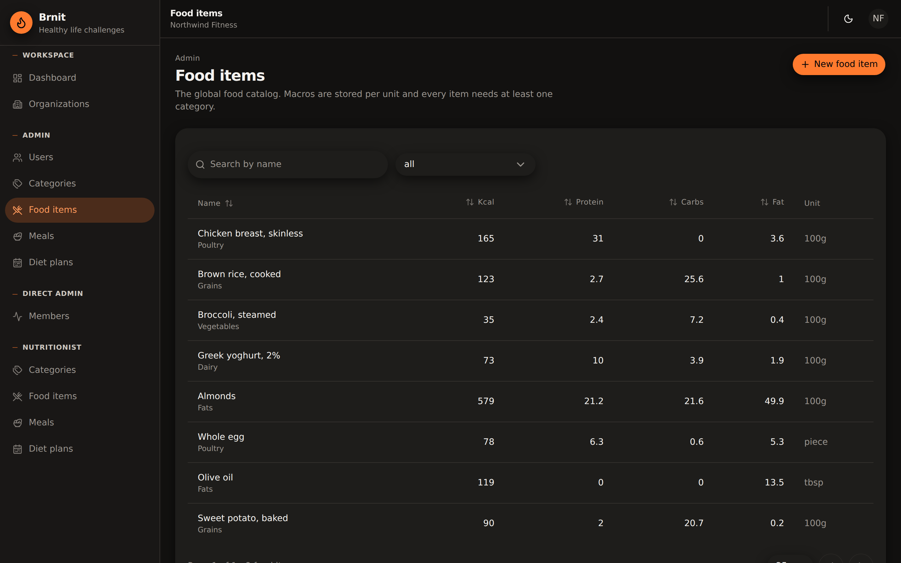 |
| `/dashboard/admin/food-items` — light | the same screen, dark |

The URL carries the full list state
(`?categoryId=&page=1&perPage=25&q=&sortBy=createdAt&sortOrder=desc`), parsed
and validated by the route's search schema, so a filtered table is a shareable
link and a back button works.

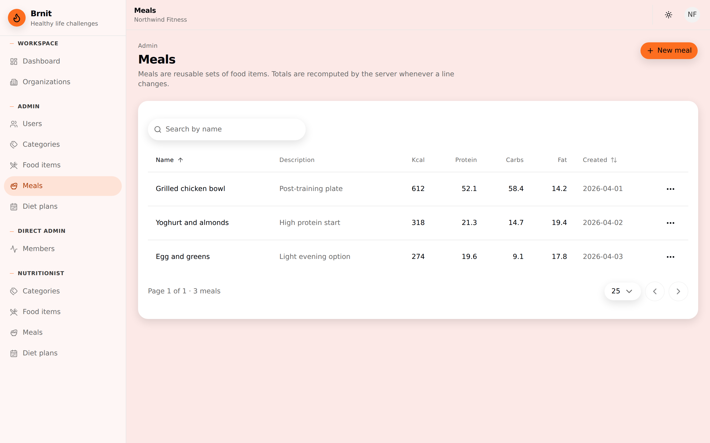

`/dashboard/admin/meals`. The macro columns here are the persisted
`total_*` values — rounded once, at the end, to 2dp. See §7 on why that is not
the same rule the native app uses.

| | |
| --- | --- |
| 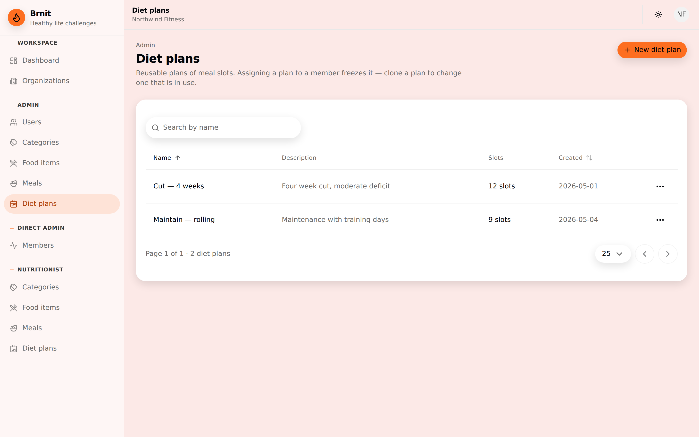 | 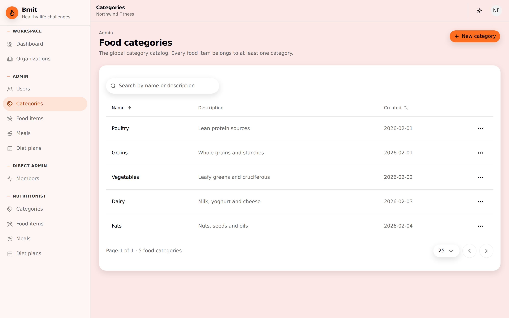 |
| `/dashboard/admin/diet-plans` | `/dashboard/admin/categories` |

### Organizations and nutritionist

| | |
| --- | --- |
| 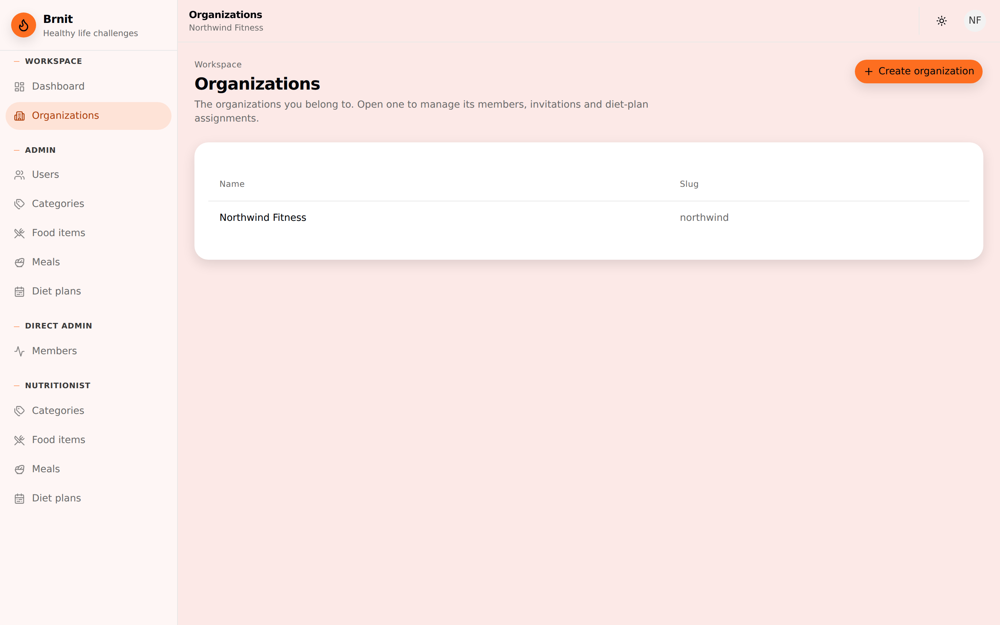 | 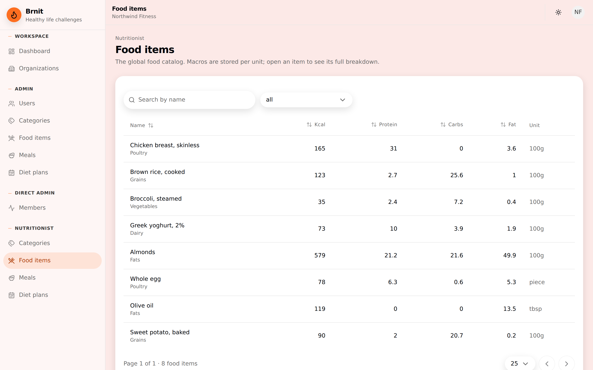 |
| `/dashboard/organizations` | `/dashboard/nutritionist/food-items` |

The nutritionist tree is a separate route group with its own `beforeLoad`
guard and its own org-scoped endpoints — not the admin screens with a
permission check bolted on.

### Responsive

| | |
| --- | --- |
| 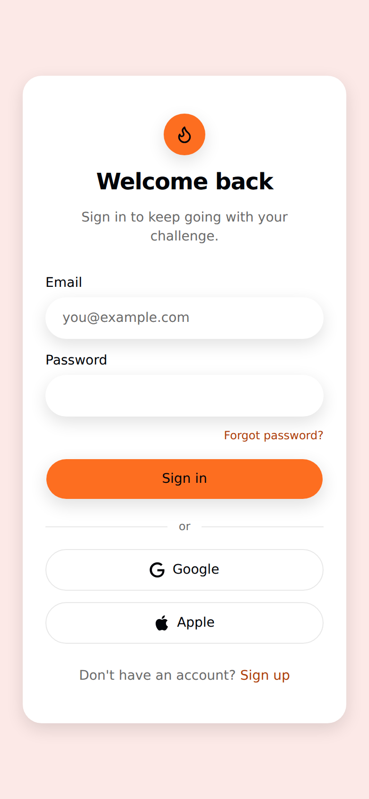 | 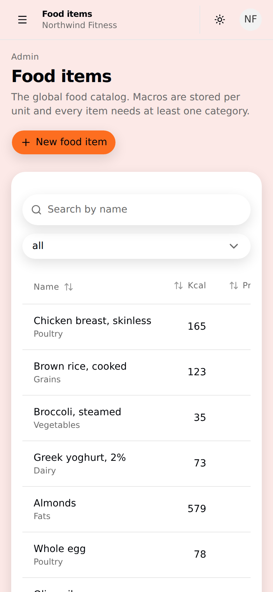 |
| `/login` at 390×844 | the food-items table at 390×844 |

## 5. Verification

Everything below was run on the final commit and passed.

| Check | Result |
| --- | --- |
| `bun run check-types` | 14 tasks, clean |
| `bun run test` | **926 tests across 76 files, 0 failures** |
| `bunx ultracite check` | 704 files, 0 errors |
| `apps/server` production build | passes |
| `apps/web` production build | passes |
| Bundle audit | no Drizzle, `pg-core`, `cloudinary` or `firebase-admin` in the browser bundle |

Two things **could not** be verified here, and should be the first things you do:

1. **Migrations against a real database.** There is no PostgreSQL in this
   environment. `bun run db:migrate` has never been run against a real server on
   this branch. The one new migration is `0024_aromatic_omega_sentinel.sql`
   (`device_token`); it is additive, but run it on a copy first.
2. **The apps actually running end to end.** The server has never talked to a
   real database here, and native has never been built. Unit and route tests
   cover the handlers, but nothing has exercised a real boot.

### A testing rule you will trip over

Run tests **per workspace**. `bun run test` is `turbo test`, which gives each
workspace its own process. Running `bun test packages/ apps/` in one command
fails tests that pass in isolation: `mock.module` is process-wide and permanent,
so the server's route mocks leak into handler tests that run afterwards.

Environment placeholders live in `test-setup.ts`, preloaded by each workspace's
test script — each script names `--preload ../../test-setup.ts` explicitly,
because `[test] preload` in `bunfig.toml` resolves against the cwd and turbo
runs inside each package. Individual test files must not set `process.env`:
`@brnit/env` validates and freezes on first import, so whichever file got there
first would decide what the whole suite sees.

## 6. Bugs found during the migration

Porting a codebase reads every line of it. These were pre-existing defects,
found and fixed on the way through. They are the part of this work most worth
reviewing, because each one is a behaviour change.

### Would have taken the server down

- **`APPLE_PRIVATE_KEY` boot blocker.** `packages/auth` called `.replaceAll()`
  on an *optional* env var at module load. Without Apple OAuth configured, the
  entire server crashed on start. Now guarded, with a test.

### Security and data-scoping

- **Nutritionist consumption endpoints were not org-scoped.** Any nutritionist
  could read — and then write, and delete — any client's consumption log,
  in any organization. All three verbs are now org-scoped. Out-of-org requests
  return **404, not 403**, so ids cannot be probed.
- **Cloudinary assets leaked.** `extractPublicId` dropped the folder segment on
  version-less URLs — exactly the shape `buildCloudinaryUrl` produces — so the
  destroy call silently targeted the wrong id and old avatars were never
  deleted. The failure was swallowed.

### Contract violations

- **Meal mutation endpoints returned raw Drizzle rows.** `POST`, `PATCH`,
  `DELETE` and clone returned `total_*` as numeric *strings*, while `GET`
  returned rounded *numbers* — and the client type declared `number`. All six
  now return the same DTO.
- **Client errors surfaced as 500s.** Deleting a food category still in use
  threw; it is now a 409. Creating a food item with unknown category ids threw;
  it is now a 400, matching what update already did.

### Cross-platform correctness

- **Native rounding drifted from the server.** `sumMacros` used its own
  rounding, so a total on the phone could differ from the same total on the web.
- **Date of birth parsed at local midnight**, not UTC — a day off for every
  user at a positive UTC offset.
- **Two hand-written response types were wrong.** Mark-consumed, and
  set-override — whose `created` flag was silently dropped.

### UI

- `getTextFromSelectItemChildren("")` returned `""` where the caller expected
  `undefined`, so a Select rendered a blank trigger instead of its placeholder.
- `ComboboxInput`'s `size` prop collapsed to `never` — the variant union was
  intersected with the native `<input size>`, a number.
- `BreadcrumbPage` carried `role="link"` on a non-focusable span.
  `aria-current="page"` alone is the WAI-ARIA pattern.
- `Field` wrapped every single label+control pair in `role="group"`, which is
  what `FieldSet` is for.
- **General Sans was never loaded.** It was declared in `--font-sans` with no
  `@font-face`, no font file and no link tag anywhere in the repo. Every screen
  silently fell back to `system-ui`. Now actually loaded.
- `mealType` was a four-option `<select>`, but the column is free text ≤ 50 —
  so an existing value like "pre-workout" was silently rewritten on save.
- Slot summaries printed grams for every unit, including pieces and tablespoons.
- Admin macros rounded to 1dp — a *third* rounding rule, undocumented.

### Caching

- `adminUsersQueryKey` omitted role, sortBy and sortOrder; `dietPlanAssignmentsQueryKey`
  omitted memberId. Both collided across distinct queries, so one view could
  serve another's cached data. Both extended.

## 7. Two things that look like bugs and are not

**There are two rounding rules, and they are not interchangeable.**
Persisted meal totals round **once, at the end, to 2dp**. Everything a member
sees rounds **up, to the nearest tenth, at every step**. A member's slot must
never show less than what they will actually eat, which is why the second rule
compounds deliberately. `@brnit/domain` documents both. If you "fix" one to
match the other, you will break the other one's reason for existing.

**Dates are `'YYYY-MM-DD'` strings, computed in UTC**, end to end, via
`@brnit/datetime`. They are never `Date` objects at a boundary. This is what
the DOB bug above was.

## 8. Open questions for you

1. **`direct_admin` invite rights.** The docs and the access-control layer
   disagreed about whether a `direct_admin` can invite. You chose to grant it,
   and the permission statements now say so. It is a genuine widening of that
   role — worth a second look before this ships.
   Two predicates now exist and are not the same thing: `canInviteMembers`
   (owner, direct_admin, client_admin — gates the invite dialog) and
   `canInviteWithAnyRole` (owner, direct_admin — gates the role selector).
2. **Reminder schedules are UTC wall-clock.** Meal reminders and streak nudges
   fire on a UTC cron because no timezone is stored for a member, an
   organization or a plan. A member in UTC+4 gets an 18:00 nudge at 22:00 local.
   The fix is a real `timezone` column, not a guess from an IP address —
   `apps/server/src/jobs/*-contract.ts` explains this at each site.
3. **Push is server-side only until Firebase is configured.** The send path,
   device-token registration, the queue and the worker are all built and tested,
   but `FIREBASE_PROJECT_ID` and `FIREBASE_SERVICE_ACCOUNT_JSON` are unset, so
   `@brnit/env` logs a warning and the feature stays off. Nothing crashes; it
   just does not send.

## 9. Two endpoints deliberately not ported

- `/api/cloudinary/sign` — dead. Its only caller was a hook nothing imported.
- `getDietPlanSlotsForMember` — implemented, but no route ever reached it.

Both are in git history if you want them back.

## 10. Where to read more

| Where | What |
| --- | --- |
| `docs/migration/architecture.md` | the target architecture, and the decision behind each choice |
| `docs/migration/api-surface.md` | every endpoint, its guard, and the business rules §8.1–§8.10 |
| `docs/migration/data-layer.md` | 21 tables, the migration traps, and why Drizzle stays |
| `docs/migration/frontend.md` | route conventions, query keys, mutations, forms, a11y |
| `design-system/MASTER.md` | tokens, components, and the rules that govern them |
| `docs/ROLES.md` | app roles and organisation roles |
| `README.md` | getting started — every command verified against the manifests |

## 11. Reproducing the screenshots

The tooling is not committed — it is a stub, and a stub that lives in the repo
eventually gets mistaken for a fixture. To rebuild it:

1. Serve fixture JSON on the routes in §4 at `:4000`, with CORS for the SPA origin.
2. `VITE_SERVER_URL=http://localhost:4000 VITE_API_VERSION=1 bun run --cwd apps/web build`
3. Serve `apps/web/dist` with an SPA fallback.
4. Drive it with `playwright-core` at `/opt/pw-browsers/chromium-1194/chrome-linux/chrome`,
   `deviceScaleFactor: 2`, setting `localStorage["vite-ui-theme"]` in an init
   script for the dark shots.

With a real database, skip all of it: `bun run db:migrate && bun run dev`.
